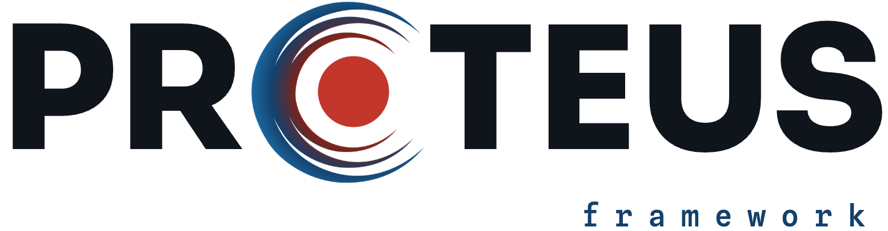

<p align="center">
  <picture>
    <source media="(prefers-color-scheme: dark)" srcset="logo/lockup/proteus-lockup-dark-transparent.png">
    <source media="(prefers-color-scheme: light)" srcset="logo/lockup/proteus-lockup-light-transparent.png">
    
  </picture>
</p>

# PROTEUS Visual Language

The official visual identity of the **PROTEUS Framework** — a coupled
interior–atmosphere evolution code for rocky planets, developed by the
[Forming Worlds Lab](https://www.formingworlds.space).

The system is codenamed **Thermocline**. It encodes one story: the
transition of a rocky planet from a **magma ocean** to a **water world**.
Red = hot state, black = deep time, blue = cool state.

> **Brand guide:** https://formingworlds.github.io/proteus-visual-language
> (rendered from `site/`) · PDF at
> [brand-guide.pdf](https://formingworlds.github.io/proteus-visual-language/brand-guide.pdf)

---

## What's here

This is a monorepo. Each top-level folder is independently consumable.

| Folder | What it is | How to consume |
|---|---|---|
| [`tokens/`](tokens/) | Colours, type, spacing, radii — the source of truth. | npm: `@formingworlds/proteus-tokens` (CSS / JSON / SCSS) |
| [`logo/`](logo/) | Glyph colorways, lockups, favicon. Formats: SVG, PNG, JPG, PDF. | download the files |
| [`fonts/`](fonts/) | The three type families. | see [`fonts/README.md`](fonts/README.md) |
| [`templates/`](templates/) | Production stylesheets + reference pages for web, docs, decks, poster. | copy the CSS/JS into your project |
| [`figures/proteus-mpl/`](figures/proteus-mpl/) | Matplotlib theme for publication figures. | PyPI: `pip install proteus-mpl` |
| [`talks/beamer/`](talks/beamer/) | LaTeX Beamer theme. | copy into your `.tex` project |
| [`community/`](community/) | GitHub banners, module identities, diagram language, stickers. | reference / export |
| [`docs/`](docs/) | The brand guide, written out per topic. | start at [`docs/README.md`](docs/README.md) |
| [`site/`](site/) | The interactive brand guide (deployed to Pages). | open `site/index.html` |

Repo meta: [`CONTRIBUTING.md`](CONTRIBUTING.md) (ground rules and releasing),
[`CHANGELOG.md`](CHANGELOG.md), [`SETUP.md`](SETUP.md) (maintainer setup).
CI in [`.github/workflows/`](.github/workflows/) deploys the brand guide,
checks token sync, and publishes the packages on release tags.

---

## Quickstart

**Use the colours in a web project**
```bash
npm install @formingworlds/proteus-tokens
```
```css
@import "@formingworlds/proteus-tokens/tokens.css";
.hot { color: var(--pt-magma); }
```
Or drop [`tokens/tokens.css`](tokens/tokens.css) in directly. Machine-readable
[`tokens.json`](tokens/tokens.json) and [`tokens.scss`](tokens/tokens.scss) ship
alongside.

**Brand your matplotlib figures**
```bash
pip install proteus-mpl
```
```python
import proteus_mpl
proteus_mpl.use()          # or use("dark")
```

**Theme a docs site (zensical / mkdocs)**
Copy [`templates/docs/extra.css`](templates/docs/extra.css) into your build,
copy the font files from [`fonts/`](fonts/) into `docs/stylesheets/fonts/`
(the stylesheet loads them; details in
[`templates/README.md`](templates/README.md)), and add the logo + favicon
from [`logo/`](logo/). Dark (default, OS-aware) and light schemes are
included.

**Build a slide deck or poster**
See [`templates/deck/`](templates/deck/) and [`templates/poster/`](templates/poster/).

---

## The one thing to get right

Every value traces back to [`tokens/tokens.css`](tokens/tokens.css). Never
hard-code a colour, font, or size that already exists as a token. The full
rationale is in [`docs/`](docs/) and the interactive guide.

Fonts are **Sora** (display) · **Instrument Sans** (body/UI) · **Spline Sans
Mono** (code, labels, metadata); never Space Grotesk or JetBrains Mono.

---

## License

Dual-licensed — see [`LICENSE`](LICENSE):

- **Code** (tokens, stylesheets, `proteus-mpl`, Beamer theme, build scripts):
  [Apache-2.0](LICENSE-CODE).
- **Creative assets** (logo, brand guide, figures, templates as designs):
  [CC BY 4.0](LICENSE-ASSETS.md).
- **Fonts** are third-party works under the
  [SIL Open Font License 1.1](fonts/OFL.txt); they are not covered by either
  grant above.
- **The PROTEUS logo and wordmark** are reserved marks — see the usage note in
  `LICENSE-ASSETS.md`. Don't ship forks or unrelated products under the PROTEUS
  identity.

© 2023–2026 Forming Worlds Lab · Thermocline v1.1
