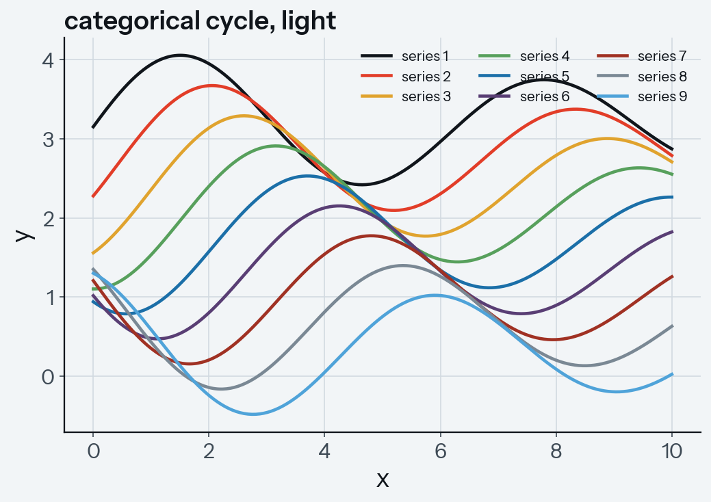
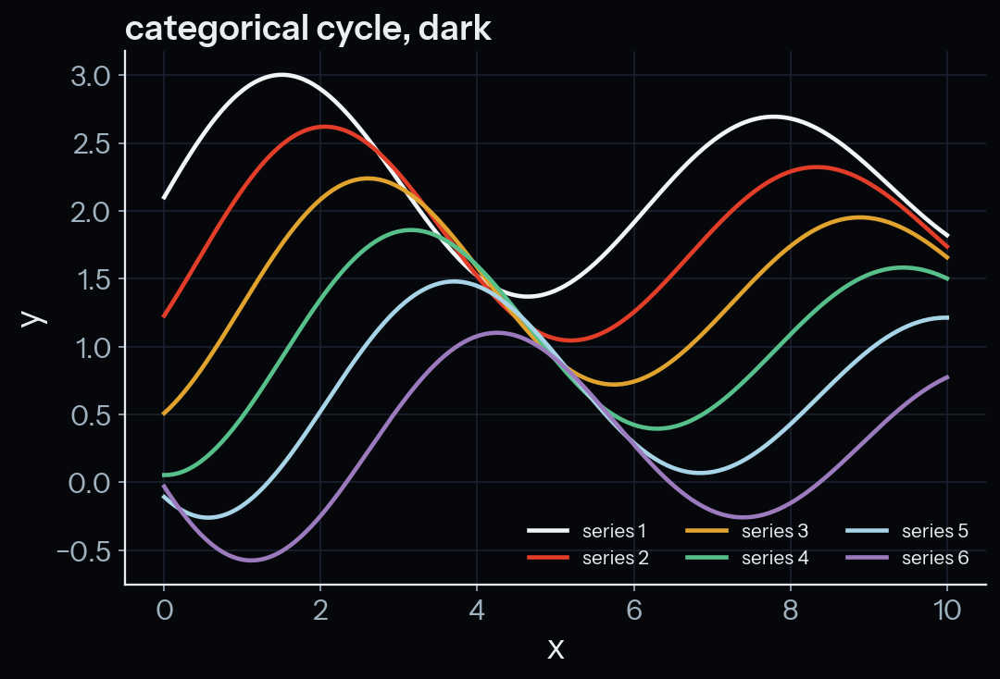

# proteus-mpl

PROTEUS Thermocline matplotlib theme. Publication-grade figures whose colors,
fonts, and surfaces match the slides, the website, and the docs.

## Install

```bash
pip install proteus-mpl
```

From a checkout of the repository: `pip install figures/proteus-mpl` (or cd
into the folder and `pip install .`).

## Use

```python
import proteus_mpl
proteus_mpl.use()           # light: Paper background — papers, light slides
# proteus_mpl.use("dark")   # dark: Void background — dark slides, hero figures
# proteus_mpl.use("white")  # light theme on pure white — journal pages
```

## What you get

- **Cycles** — both neutral-first, so a single-series plot draws in ink
  (light) / paper (dark) and magma stays a deliberate signal. Light
  (`proteus_mpl.CYCLE`, 9 colours): ink, magma, solar, verdant, ocean, tidal,
  outgassing, fog, azure; CVD worst-pair ΔE 15.7 (Machado 2009). Dark
  (`CYCLE_DARK`, 6 colours): paper, magma, solar, and light-safe tones; ΔE
  16.8. Past the cycle, switch line style (solid/dashed/dotted/dash-dot)
  instead of adding hues, and keep legends on multi-series plots.
- **Accents** — `COLORS["solar"]` (`#E0A32E`, the star) with
  `COLORS["solar_deep"]` (`#C8860F`) for gold fills or thin marks on light
  surfaces, and `COLORS["verdant"]` (`#57A05C`, the habitable endpoint).
- **Module domain colors** — `proteus_mpl.DOMAINS["interior"]` etc. Use these
  whenever a line *is* a module (SPIDER output → interior red, MORS → solar
  gold). Stable across every paper, talk, and diagram.
- **Colormaps** — `proteus` (sequential, Void→Paper; default for imshow /
  pcolormesh; the one ramp that survives greyscale reproduction),
  `proteus_div` (diverging, light midpoint — print-safe for
  anomalies/residuals), `proteus_phase` (the brand ramp, magma→void→ocean,
  dark midpoint — hero figures and dark slides). `_r` reversals registered.
- **Type** — Instrument Sans labels, Spline Sans Mono available for ticks via
  `fontfamily="Spline Sans Mono"`; titles bold, left-aligned. The OFL brand
  fonts ship inside the package and register automatically on `use()`.
- **Publication settings** — 300 dpi savefig, tight bbox, TrueType embedding
  (fonttype 42), text-as-paths SVG. Prefer `fig.savefig("fig.pdf")`.

## The cycle on each surface




Regenerate with `python examples/cycle.py`.

## Conventions

- Size figures at final printed size (A&A column ≈ 3.5 in) and keep default
  font sizes — never shrink a huge figure down.
- Light figures on light surfaces, dark figures on dark — no visible card.
- Journal white pages: `use("white")`, or `transparent=True` at savefig.
- Magma is the *hot signal*: reserve it for the series you want the room to
  look at. Everything else starts from Ocean.
